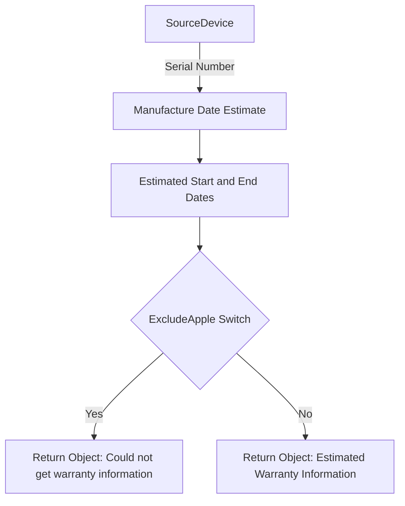

Apple Warranty refers to the process of estimating the warranty expiry dates for Apple devices. This estimation is necessary because Apple does not provide an API for exact warranty information.

The estimation process uses a predefined set of manufacture date ranges based on the serial number of the device. These ranges provide an estimated start and end date for the warranty.

## Supported Manufacturers

Apple is listed as one of the supported manufacturers, but it uses estimated dates for warranty information.

## Apple Note

Due to changes in how Apple generates serial numbers, it is challenging to determine accurate warranty expiry dates for newer devices. As a result, the estimated dates might be inaccurate.

To avoid updating systems with potentially incorrect data, users can use the `-ExcludeApple` switch in the `Update-Warrantyinfo.ps1` script to skip updating warranty information for Apple devices.

The function <SwmToken path="/private/Get-AppleWarranty.ps1" pos="1:2:4" line-data="function get-AppleWarranty([Parameter(Mandatory = $true)]$SourceDevice, $Client) {" repo-id="Z2l0aHViJTNBJTNBUG93ZXJTaGVsbFdhcnJhbnR5UmVwb3J0cyUzQSUzQVN3aW1tLURlbW8=" repo-name="PowerShellWarrantyReports">`get-AppleWarranty`</SwmToken> is responsible for generating these estimated warranty dates. It creates a custom object with the estimated start and end dates based on the device's serial number.

If the `-ExcludeApple` switch is not used, the function returns an object with the estimated warranty information. Otherwise, it returns an object indicating that warranty information could not be retrieved.

<SwmSnippet path="/public/Get-WarrantyInfo.ps1" line="14" repo-id="Z2l0aHViJTNBJTNBUG93ZXJTaGVsbFdhcnJhbnR5UmVwb3J0cyUzQSUzQVN3aW1tLURlbW8=">

---

The function <SwmToken path="/private/Get-AppleWarranty.ps1" pos="1:2:4" line-data="function get-AppleWarranty([Parameter(Mandatory = $true)]$SourceDevice, $Client) {" repo-id="Z2l0aHViJTNBJTNBUG93ZXJTaGVsbFdhcnJhbnR5UmVwb3J0cyUzQSUzQVN3aW1tLURlbW8=" repo-name="PowerShellWarrantyReports">`get-AppleWarranty`</SwmToken> is used within <SwmToken path="/public/Get-WarrantyInfo.ps1" pos="1:2:4" line-data="function  Get-Warrantyinfo {" repo-id="Z2l0aHViJTNBJTNBUG93ZXJTaGVsbFdhcnJhbnR5UmVwb3J0cyUzQSUzQVN3aW1tLURlbW8=" repo-name="PowerShellWarrantyReports">`Get-Warrantyinfo`</SwmToken> to retrieve warranty information for Apple devices.

```powershell
            MS { Get-MSWarranty -SourceDevice $DeviceSerial -Client $line.client }
            Apple { get-AppleWarranty -SourceDevice $DeviceSerial -client $line.client }
            Toshiba { get-ToshibaWarranty -SourceDevice $DeviceSerial -client $line.client }
```

---

</SwmSnippet>

<SwmSnippet path="/private/Get-AppleWarranty.ps1" line="1" repo-id="Z2l0aHViJTNBJTNBUG93ZXJTaGVsbFdhcnJhbnR5UmVwb3J0cyUzQSUzQVN3aW1tLURlbW8=">

---

The function <SwmToken path="/private/Get-AppleWarranty.ps1" pos="1:2:4" line-data="function get-AppleWarranty([Parameter(Mandatory = $true)]$SourceDevice, $Client) {" repo-id="Z2l0aHViJTNBJTNBUG93ZXJTaGVsbFdhcnJhbnR5UmVwb3J0cyUzQSUzQVN3aW1tLURlbW8=" repo-name="PowerShellWarrantyReports">`get-AppleWarranty`</SwmToken> is responsible for generating estimated warranty dates based on the device's serial number. It returns an object with the estimated warranty information or an object indicating that warranty information could not be retrieved if the `-ExcludeApple` switch is used.

```powershell
function get-AppleWarranty([Parameter(Mandatory = $true)]$SourceDevice, $Client) {
    #Apple warranty check uses estimates, not exacts as they have no API.
    $ManafactureDateEstimate = [PSCustomObject]@{
        "C" = @{ 
            StartDate = "2010 (1st half)"
            EndDate   = "2012 (Estimate)"
        }
        "D" = @{ 
            StartDate = "2010 (2nd half)"
            EndDate   = "2012/2013 (Estimate)"
        }
        
        "F" = @{ 
            StartDate = "2011 (1st half)"
            EndDate   = "2013 (Estimate)"
        }
        "G" = @{ 
            StartDate = "2011 (2nd half)"
            EndDate   = "2013/2014 (Estimate)"
        }
        "H" = @{ 
```

---

</SwmSnippet>

# The Flow



&nbsp;

*This is an auto-generated document by Swimm AI 🌊 and has not yet been verified by a human*

<SwmMeta version="3.0.0" doc-type="overview"><sup>Powered by [Swimm](https://app.swimm.io/)</sup></SwmMeta>
