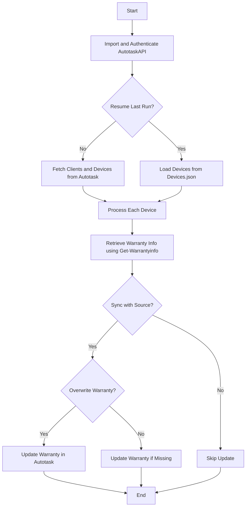

Autotask Warranty refers to the functionality within the PowerShellWarrantyReports module that automates the retrieval and reporting of warranty information for devices managed through the Autotask PSA (Professional Services Automation) platform.

The function <SwmToken path="/private/Get-WarrantyAutotask.ps1" pos="1:2:4" line-data="function Get-WarrantyAutotask {" repo-id="Z2l0aHViJTNBJTNBUG93ZXJTaGVsbFdhcnJhbnR5UmVwb3J0cyUzQSUzQVN3aW1tLURlbW8=" repo-name="PowerShellWarrantyReports">`Get-WarrantyAutotask`</SwmToken> is responsible for logging into Autotask, retrieving client and device information, and then fetching warranty details for each device.

The retrieved warranty information can be synchronized back to Autotask, updating the warranty expiration dates for the devices if the <SwmToken path="/private/Get-WarrantyAutotask.ps1" pos="6:5:5" line-data="        [boolean]$SyncWithSource," repo-id="Z2l0aHViJTNBJTNBUG93ZXJTaGVsbFdhcnJhbnR5UmVwb3J0cyUzQSUzQVN3aW1tLURlbW8=" repo-name="PowerShellWarrantyReports">`SyncWithSource`</SwmToken> parameter is set to true.

This process involves using the Autotask API to gather data and the <SwmToken path="/public/Get-WarrantyInfo.ps1" pos="1:2:4" line-data="function  Get-Warrantyinfo {" repo-id="Z2l0aHViJTNBJTNBUG93ZXJTaGVsbFdhcnJhbnR5UmVwb3J0cyUzQSUzQVN3aW1tLURlbW8=" repo-name="PowerShellWarrantyReports">`Get-Warrantyinfo`</SwmToken> function to obtain the actual warranty details from various manufacturers.

## Autotask

To execute an update of all devices in Autotask use:

<SwmSnippet path="private/Get-WarrantyAutotask.ps1" line="1" repo-id="Z2l0aHViJTNBJTNBUG93ZXJTaGVsbFdhcnJhbnR5UmVwb3J0cyUzQSUzQVN3aW1tLURlbW8=">

---

The function <SwmToken path="/private/Get-WarrantyAutotask.ps1" pos="1:2:4" line-data="function Get-WarrantyAutotask {" repo-id="Z2l0aHViJTNBJTNBUG93ZXJTaGVsbFdhcnJhbnR5UmVwb3J0cyUzQSUzQVN3aW1tLURlbW8=" repo-name="PowerShellWarrantyReports">`Get-WarrantyAutotask`</SwmToken> handles the retrieval and updating of warranty information for devices in Autotask.

```
function Get-WarrantyAutotask {
    [CmdletBinding()]
    Param(
        [Pscredential]$AutotaskCredentials,
        [String]$AutotaskAPIKey,
        [boolean]$SyncWithSource,
        [boolean]$Missingonly,
        [boolean]$OverwriteWarranty
    )
    If (Get-Module -ListAvailable -Name "AutoTaskAPI") { Import-module "AutotaskAPI" } Else { install-module "AutotaskAPI" -Force }
    Import-Module AutotaskAPI
    Add-AutotaskAPIAuth -ApiIntegrationcode $AutotaskAPIKey -credentials $AutotaskCredentials
```

---

</SwmSnippet>

<SwmSnippet path="/private/Get-WarrantyAutotask.ps1" line="13" repo-id="Z2l0aHViJTNBJTNBUG93ZXJTaGVsbFdhcnJhbnR5UmVwb3J0cyUzQSUzQVN3aW1tLURlbW8=">

---

Depending on whether a previous run exists, it either resumes from the last state or fetches all client and device information from Autotask.

```powershell
    If ($ResumeLast) {
        write-host "Found previous run results. Starting from last object." -foregroundColor green
        $AllDevices = get-content 'Devices.json' | convertfrom-json
    }
    else {
        write-host "Logging into Autotask. Grabbing all client information." -ForegroundColor "Green"
        $AllClients = Get-AutotaskAPIResource -resource Companies -SimpleSearch 'isactive eq true' 
        write-host "Client information found. Grabbing all devices" -ForegroundColor "Green"
        $AllDevices = Get-AutotaskAPIResource -resource ConfigurationItems -SimpleSearch 'isactive eq true'
        write-host "Collecting information. This can take a long time." -ForegroundColor "Green"
    }
```

---

</SwmSnippet>

<SwmSnippet path="/private/Get-WarrantyAutotask.ps1" line="24" repo-id="Z2l0aHViJTNBJTNBUG93ZXJTaGVsbFdhcnJhbnR5UmVwb3J0cyUzQSUzQVN3aW1tLURlbW8=">

---

The function processes each device, retrieves warranty information using <SwmToken path="private/Get-WarrantyAutotask.ps1" pos="31:6:8" line-data="        $WarState = Get-Warrantyinfo -DeviceSerial $device.serialnumber -client $Client" repo-id="Z2l0aHViJTNBJTNBUG93ZXJTaGVsbFdhcnJhbnR5UmVwb3J0cyUzQSUzQVN3aW1tLURlbW8=" repo-name="PowerShellWarrantyReports">`Get-Warrantyinfo`</SwmToken>, and optionally updates the source with the new warranty data.

```powershell
    $i = 0
    $warrantyObject = foreach ($Device in $AllDevices) {
        $i++
        Write-Progress -Activity "Grabbing Warranty information" -status "Processing $($device.serialnumber). Device $i of $($Alldevices.Count)" -percentComplete ($i / $Alldevices.Count * 100)
        $Client = ($AllClients | Where-Object { $_.id -eq $device.companyID }).CompanyName
        $RemainingList = set-content 'Devices.json' -force -value ($AllDevices | select-object -skip $alldevices.indexof($device) | convertto-json -depth 5)

        $WarState = Get-Warrantyinfo -DeviceSerial $device.serialnumber -client $Client

        if ($SyncWithSource -eq $true) {
            switch ($OverwriteWarranty) {
                $true {
                    if ($null -ne $warstate.EndDate) {
                        $device | ForEach-Object { $_.warrantyExpirationDate = $warstate.EndDate; $_ } | Set-AutotaskAPIResource -Resource ConfigurationItems
                        "$((get-date).ToUniversalTime().ToString('yyyy-MM-dd HH:mm:ss')) Autotask: $Client / $($device.SerialNumber) with AT ID $($device.id) warranty has been overwritten to $($warstate.EndDate)" | out-file $script:LogPath -Append -Force
                    }
                     
                }
                $false { 
                    if ($null -eq $device.WarrantyExpirationDate -and $null -ne $warstate.EndDate) { 
                        $device | ForEach-Object { $_.warrantyExpirationDate = $warstate.EndDate; $_ } | Set-AutotaskAPIResource -Resource ConfigurationItems
```

---

</SwmSnippet>

<SwmSnippet path="/public/Get-WarrantyInfo.ps1" line="1" repo-id="Z2l0aHViJTNBJTNBUG93ZXJTaGVsbFdhcnJhbnR5UmVwb3J0cyUzQSUzQVN3aW1tLURlbW8=">

---

The function <SwmToken path="/public/Get-WarrantyInfo.ps1" pos="1:2:4" line-data="function  Get-Warrantyinfo {" repo-id="Z2l0aHViJTNBJTNBUG93ZXJTaGVsbFdhcnJhbnR5UmVwb3J0cyUzQSUzQVN3aW1tLURlbW8=" repo-name="PowerShellWarrantyReports">`Get-Warrantyinfo`</SwmToken> is called within <SwmToken path="/private/Get-WarrantyAutotask.ps1" pos="1:2:4" line-data="function Get-WarrantyAutotask {" repo-id="Z2l0aHViJTNBJTNBUG93ZXJTaGVsbFdhcnJhbnR5UmVwb3J0cyUzQSUzQVN3aW1tLURlbW8=" repo-name="PowerShellWarrantyReports">`Get-WarrantyAutotask`</SwmToken> to fetch warranty details from various manufacturers.

```powershell
function  Get-Warrantyinfo {
    [CmdletBinding()]
    Param(
        [string]$DeviceSerial,
        [String]$client,
        [String]$vendor
    )
    if ($LogActions) { add-content -path $LogFile -Value "Starting lookup for $($DeviceSerial),$($Client)" -force }
    if ($vendor) {
        switch ($vendor) {
            HP { get-HPWarranty -SourceDevice $DeviceSerial -Client $line.client }
            Dell { get-DellWarranty -SourceDevice $DeviceSerial -Client $line.client }
            Lenovo { get-LenovoWarranty -SourceDevice $DeviceSerial -Client $line.client }
            MS { Get-MSWarranty -SourceDevice $DeviceSerial -Client $line.client }
            Apple { get-AppleWarranty -SourceDevice $DeviceSerial -client $line.client }
            Toshiba { get-ToshibaWarranty -SourceDevice $DeviceSerial -client $line.client }
        }
    }
    else {
        switch ($DeviceSerial.Length) {
            7 { get-DellWarranty -SourceDevice $DeviceSerial -client $Client }
```

---

</SwmSnippet>

Here is a visualization:



*This is an auto-generated document by Swimm AI 🌊 and has not yet been verified by a human*

<SwmMeta version="3.0.0" doc-type="overview"><sup>Powered by [Swimm](https://app.swimm.io/)</sup></SwmMeta>
