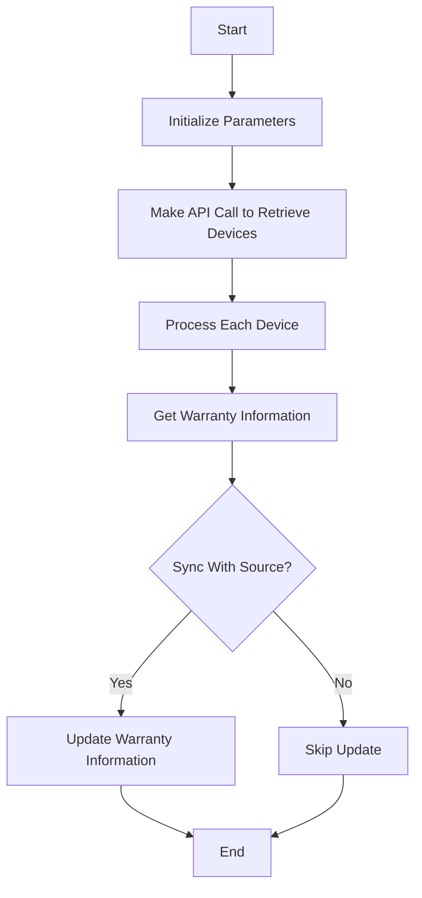

BTIO Warranty refers to the process of retrieving and updating warranty information for devices managed by .

The function <SwmToken path="/private/Get-WarrantyBTIO.ps1" pos="1:2:4" line-data="function  Get-WarrantyBTIO {" repo-id="Z2l0aHViJTNBJTNBUG93ZXJTaGVsbFdhcnJhbnR5UmVwb3J0cyUzQSUzQVN3aW1tLURlbW8=" repo-name="PowerShellWarrantyReports">`Get-WarrantyBTIO`</SwmToken> is responsible for fetching all devices from BluetraitIO using an API key and URL.

It sends a request to the BluetraitIO API to get a list of devices and then processes each device to retrieve its warranty information.

The warranty information is obtained by calling the <SwmToken path="/private/Get-WarrantyBTIO.ps1" pos="36:6:8" line-data="        $WarState = Get-Warrantyinfo -DeviceSerial $device.hw_serial_number -client $device.company_name" repo-id="Z2l0aHViJTNBJTNBUG93ZXJTaGVsbFdhcnJhbnR5UmVwb3J0cyUzQSUzQVN3aW1tLURlbW8=" repo-name="PowerShellWarrantyReports">`Get-Warrantyinfo`</SwmToken> function, which determines the warranty details based on the device's serial number and client information.

If the <SwmToken path="/private/Get-WarrantyBTIO.ps1" pos="6:5:5" line-data="        [boolean]$SyncWithSource," repo-id="Z2l0aHViJTNBJTNBUG93ZXJTaGVsbFdhcnJhbnR5UmVwb3J0cyUzQSUzQVN3aW1tLURlbW8=" repo-name="PowerShellWarrantyReports">`SyncWithSource`</SwmToken> parameter is set to true, the function will update the warranty expiration date in BluetraitIO if the date format is valid.

The <SwmToken path="/private/Get-WarrantyBTIO.ps1" pos="8:5:5" line-data="        [boolean]$OverwriteWarranty" repo-id="Z2l0aHViJTNBJTNBUG93ZXJTaGVsbFdhcnJhbnR5UmVwb3J0cyUzQSUzQVN3aW1tLURlbW8=" repo-name="PowerShellWarrantyReports">`OverwriteWarranty`</SwmToken> parameter controls whether existing warranty information in BluetraitIO should be overwritten or only updated if missing.

<SwmSnippet path="/private/Get-WarrantyBTIO.ps1" line="1" repo-id="Z2l0aHViJTNBJTNBUG93ZXJTaGVsbFdhcnJhbnR5UmVwb3J0cyUzQSUzQVN3aW1tLURlbW8=">

---

## Fetching Devices

The function <SwmToken path="/private/Get-WarrantyBTIO.ps1" pos="1:2:4" line-data="function  Get-WarrantyBTIO {" repo-id="Z2l0aHViJTNBJTNBUG93ZXJTaGVsbFdhcnJhbnR5UmVwb3J0cyUzQSUzQVN3aW1tLURlbW8=" repo-name="PowerShellWarrantyReports">`Get-WarrantyBTIO`</SwmToken> fetches all devices from BluetraitIO using the provided API key and URL. It sends a request to the BluetraitIO API to get a list of devices.

```powershell
function  Get-WarrantyBTIO {
    [CmdletBinding()]
    Param(
        [String]$BTAPIKEY,
        [string]$BTAPIURL,
        [boolean]$SyncWithSource,
        [boolean]$Missingonly,
        [boolean]$OverwriteWarranty
    )
    write-host "Source is BluetraitIO. Grabbing all devices." -ForegroundColor Green


	$JSON = @{
		"api_key" = $BTAPIKEY
		"api_action" = "msp_get_agents"
		"api_version" = 1
	} | ConvertTo-Json
	
	
	try {	
```

---

</SwmSnippet>

<SwmSnippet path="/private/Get-WarrantyBTIO.ps1" line="33" repo-id="Z2l0aHViJTNBJTNBUG93ZXJTaGVsbFdhcnJhbnR5UmVwb3J0cyUzQSUzQVN3aW1tLURlbW8=">

---

## Processing Devices

Each device is processed to retrieve its warranty information by calling the `Get-Warrantyinfo` function, which determines the warranty details based on the device's serial number and client information.

```powershell
    $warrantyObject = foreach ($device in $Devices) {
		$device_name = $device.name
		Write-Host "Processing $device_name"
        $WarState = Get-Warrantyinfo -DeviceSerial $device.hw_serial_number -client $device.company_name
```

---

</SwmSnippet>

<SwmSnippet path="/private/Get-WarrantyBTIO.ps1" line="38" repo-id="Z2l0aHViJTNBJTNBUG93ZXJTaGVsbFdhcnJhbnR5UmVwb3J0cyUzQSUzQVN3aW1tLURlbW8=">

---

## Syncing Warranty Information

If the <SwmToken path="/private/Get-WarrantyBTIO.ps1" pos="6:5:5" line-data="        [boolean]$SyncWithSource," repo-id="Z2l0aHViJTNBJTNBUG93ZXJTaGVsbFdhcnJhbnR5UmVwb3J0cyUzQSUzQVN3aW1tLURlbW8=" repo-name="PowerShellWarrantyReports">`SyncWithSource`</SwmToken> parameter is set to true, the function will update the warranty expiration date in BluetraitIO if the date format is valid. The <SwmToken path="/private/Get-WarrantyBTIO.ps1" pos="8:5:5" line-data="        [boolean]$OverwriteWarranty" repo-id="Z2l0aHViJTNBJTNBUG93ZXJTaGVsbFdhcnJhbnR5UmVwb3J0cyUzQSUzQVN3aW1tLURlbW8=" repo-name="PowerShellWarrantyReports">`OverwriteWarranty`</SwmToken> parameter controls whether existing warranty information in BluetraitIO should be overwritten or only updated if missing.

```powershell
		if ($SyncWithSource -eq $true) {
			
			$theDate = $WarState.EndDate 
			$testDate = $theDate -as [DateTime];
			
			if ($testDate) {
				$useDate = $theDate.ToString("yyyy-MM-dd");
				
				write-host "Valid date format $useDate" -foregroundColor green
				
				$JSON = @{
					"api_key" = $BTAPIKEY
					"api_action" = "msp_edit_agent"
					"api_version" = 1
					"id" = $($device.id)
					"columns" = @{
						"warranty_expires" = $useDate
					}
				} | ConvertTo-Json
			
				$JSON
```

---

</SwmSnippet>

Here is a visualization:



*This is an auto-generated document by Swimm AI 🌊 and has not yet been verified by a human*

<SwmMeta version="3.0.0" doc-type="overview"><sup>Powered by [Swimm](https://app.swimm.io/)</sup></SwmMeta>
