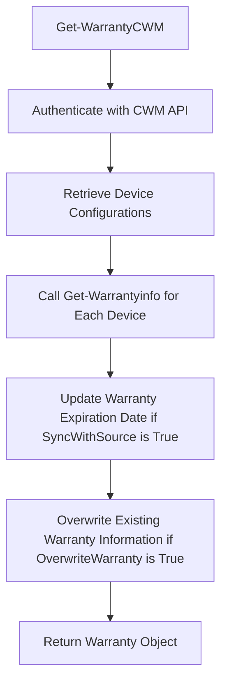

CWM Warranty refers to the process of retrieving and updating warranty information for devices managed by <SwmToken path="/private/Get-WarrantyCWM.ps1" pos="14:10:10" line-data="    Write-Host &quot;Source is Connectwise Manage. Grabbing all devices.&quot; -ForegroundColor Green" repo-id="Z2l0aHViJTNBJTNBUG93ZXJTaGVsbFdhcnJhbnR5UmVwb3J0cyUzQSUzQVN3aW1tLURlbW8=" repo-name="PowerShellWarrantyReports">`Connectwise`</SwmToken> Manage (CWM).

The function <SwmToken path="/private/Get-WarrantyCWM.ps1" pos="1:2:4" line-data="function  Get-WarrantyCWM {" repo-id="Z2l0aHViJTNBJTNBUG93ZXJTaGVsbFdhcnJhbnR5UmVwb3J0cyUzQSUzQVN3aW1tLURlbW8=" repo-name="PowerShellWarrantyReports">`Get-WarrantyCWM`</SwmToken> is responsible for fetching warranty details for devices from CWM using API calls.

It authenticates with the CWM API using a base64-encoded key and retrieves device configurations in batches.

For each device, it calls the <SwmToken path="/public/Get-WarrantyInfo.ps1" pos="1:2:4" line-data="function  Get-Warrantyinfo {" repo-id="Z2l0aHViJTNBJTNBUG93ZXJTaGVsbFdhcnJhbnR5UmVwb3J0cyUzQSUzQVN3aW1tLURlbW8=" repo-name="PowerShellWarrantyReports">`Get-Warrantyinfo`</SwmToken> function to obtain warranty details based on the device's serial number.

If the <SwmToken path="/private/Get-WarrantyCWM.ps1" pos="8:5:5" line-data="        [boolean]$SyncWithSource," repo-id="Z2l0aHViJTNBJTNBUG93ZXJTaGVsbFdhcnJhbnR5UmVwb3J0cyUzQSUzQVN3aW1tLURlbW8=" repo-name="PowerShellWarrantyReports">`SyncWithSource`</SwmToken> parameter is true, the function updates the device's warranty expiration date in CWM.

The function can also overwrite existing warranty information if the <SwmToken path="/private/Get-WarrantyCWM.ps1" pos="10:5:5" line-data="        [boolean]$OverwriteWarranty," repo-id="Z2l0aHViJTNBJTNBUG93ZXJTaGVsbFdhcnJhbnR5UmVwb3J0cyUzQSUzQVN3aW1tLURlbW8=" repo-name="PowerShellWarrantyReports">`OverwriteWarranty`</SwmToken> parameter is set to true.

The process continues until all devices are processed, and the results are returned as a warranty object.

<SwmSnippet path="/private/Get-WarrantyCWM.ps1" line="1" repo-id="Z2l0aHViJTNBJTNBUG93ZXJTaGVsbFdhcnJhbnR5UmVwb3J0cyUzQSUzQVN3aW1tLURlbW8=">

---

# <SwmToken path="/private/Get-WarrantyCWM.ps1" pos="1:2:4" line-data="function  Get-WarrantyCWM {" repo-id="Z2l0aHViJTNBJTNBUG93ZXJTaGVsbFdhcnJhbnR5UmVwb3J0cyUzQSUzQVN3aW1tLURlbW8=" repo-name="PowerShellWarrantyReports">`Get-WarrantyCWM`</SwmToken> Function

The <SwmToken path="/private/Get-WarrantyCWM.ps1" pos="1:2:4" line-data="function  Get-WarrantyCWM {" repo-id="Z2l0aHViJTNBJTNBUG93ZXJTaGVsbFdhcnJhbnR5UmVwb3J0cyUzQSUzQVN3aW1tLURlbW8=" repo-name="PowerShellWarrantyReports">`Get-WarrantyCWM`</SwmToken> function is responsible for fetching and updating warranty details for devices managed by <SwmToken path="/private/Get-WarrantyCWM.ps1" pos="14:10:10" line-data="    Write-Host &quot;Source is Connectwise Manage. Grabbing all devices.&quot; -ForegroundColor Green" repo-id="Z2l0aHViJTNBJTNBUG93ZXJTaGVsbFdhcnJhbnR5UmVwb3J0cyUzQSUzQVN3aW1tLURlbW8=" repo-name="PowerShellWarrantyReports">`Connectwise`</SwmToken> Manage (CWM).

```powershell
function  Get-WarrantyCWM {
    [CmdletBinding()]
    Param(
        [string]$CwCompanyID,
        [String]$CWMpiKeyPublic,
        [String]$CWMpiKeyprivate,
        [string]$CWMAPIURL,
        [boolean]$SyncWithSource,
        [boolean]$Missingonly,
        [boolean]$OverwriteWarranty,
        [array]$ConfigTypes
    )
 
    Write-Host "Source is Connectwise Manage. Grabbing all devices." -ForegroundColor Green
    $Base64Key = [Convert]::ToBase64String([System.Text.Encoding]::UTF8.GetBytes("$($CWcompanyid)+$($CWMpiKeyPublic):$($CWMpiKeyPrivate)"))
 
    $Header = @{
        'clientId'      = '3613dda6-fa25-49b9-85fb-7aa2b628befa' #This is the warranty script client id. Do not change. 
        'Authorization' = "Basic $Base64Key"
        'Content-Type'  = 'application/json'
    }
```

---

</SwmSnippet>

<SwmSnippet path="/public/Get-WarrantyInfo.ps1" line="1" repo-id="Z2l0aHViJTNBJTNBUG93ZXJTaGVsbFdhcnJhbnR5UmVwb3J0cyUzQSUzQVN3aW1tLURlbW8=">

---

# <SwmToken path="/public/Get-WarrantyInfo.ps1" pos="1:2:4" line-data="function  Get-Warrantyinfo {" repo-id="Z2l0aHViJTNBJTNBUG93ZXJTaGVsbFdhcnJhbnR5UmVwb3J0cyUzQSUzQVN3aW1tLURlbW8=" repo-name="PowerShellWarrantyReports">`Get-Warrantyinfo`</SwmToken> Function

The <SwmToken path="/public/Get-WarrantyInfo.ps1" pos="1:2:4" line-data="function  Get-Warrantyinfo {" repo-id="Z2l0aHViJTNBJTNBUG93ZXJTaGVsbFdhcnJhbnR5UmVwb3J0cyUzQSUzQVN3aW1tLURlbW8=" repo-name="PowerShellWarrantyReports">`Get-Warrantyinfo`</SwmToken> function is called by <SwmToken path="/private/Get-WarrantyCWM.ps1" pos="1:2:4" line-data="function  Get-WarrantyCWM {" repo-id="Z2l0aHViJTNBJTNBUG93ZXJTaGVsbFdhcnJhbnR5UmVwb3J0cyUzQSUzQVN3aW1tLURlbW8=" repo-name="PowerShellWarrantyReports">`Get-WarrantyCWM`</SwmToken> to obtain warranty details based on the device's serial number.

```powershell
function  Get-Warrantyinfo {
    [CmdletBinding()]
    Param(
        [string]$DeviceSerial,
        [String]$client,
        [String]$vendor
    )
    if ($LogActions) { add-content -path $LogFile -Value "Starting lookup for $($DeviceSerial),$($Client)" -force }
    if ($vendor) {
        switch ($vendor) {
            HP { get-HPWarranty -SourceDevice $DeviceSerial -Client $line.client }
            Dell { get-DellWarranty -SourceDevice $DeviceSerial -Client $line.client }
            Lenovo { get-LenovoWarranty -SourceDevice $DeviceSerial -Client $line.client }
            MS { Get-MSWarranty -SourceDevice $DeviceSerial -Client $line.client }
            Apple { get-AppleWarranty -SourceDevice $DeviceSerial -client $line.client }
            Toshiba { get-ToshibaWarranty -SourceDevice $DeviceSerial -client $line.client }
        }
    }
    else {
        switch ($DeviceSerial.Length) {
            7 { get-DellWarranty -SourceDevice $DeviceSerial -client $Client }
```

---

</SwmSnippet>



*This is an auto-generated document by Swimm AI 🌊 and has not yet been verified by a human*

<SwmMeta version="3.0.0" doc-type="overview"><sup>Powered by [Swimm](https://app.swimm.io/)</sup></SwmMeta>
