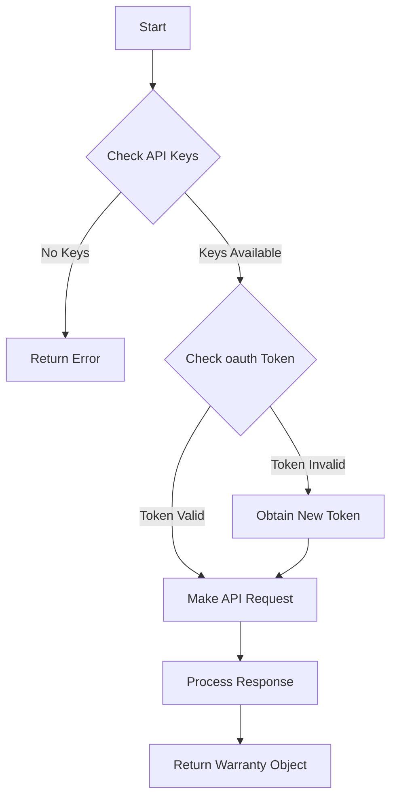

Dell Warranty refers to the process of retrieving warranty information for Dell devices using the Dell API.

The function <SwmToken path="/private/Get-DellWarranty.ps1" pos="4:2:4" line-data="function get-DellWarranty([Parameter(Mandatory = $true)]$SourceDevice, $Client) {" repo-id="Z2l0aHViJTNBJTNBUG93ZXJTaGVsbFdhcnJhbnR5UmVwb3J0cyUzQSUzQVN3aW1tLURlbW8=" repo-name="PowerShellWarrantyReports">`get-DellWarranty`</SwmToken> is responsible for fetching this warranty information by making authenticated requests to the Dell API.

The function first checks if the necessary API keys are available and then obtains an <SwmToken path="/private/Get-DellWarranty.ps1" pos="20:2:2" line-data="        $OAuth = &quot;$Script:DellClientID`:$Script:DellClientSecret&quot;" repo-id="Z2l0aHViJTNBJTNBUG93ZXJTaGVsbFdhcnJhbnR5UmVwb3J0cyUzQSUzQVN3aW1tLURlbW8=" repo-name="PowerShellWarrantyReports">`OAuth`</SwmToken> token for authentication.

It sends a request to the Dell API with the device's service tag and filters out any service level codes that are not related to hardware warranties.

The function then processes the response to extract relevant warranty details such as the start date, end date, and warranty status.

If the warranty information is successfully retrieved, it returns a custom object containing the warranty details; otherwise, it returns an object indicating that the information could not be obtained.

<SwmSnippet path="/private/Get-DellWarranty.ps1" line="4" repo-id="Z2l0aHViJTNBJTNBUG93ZXJTaGVsbFdhcnJhbnR5UmVwb3J0cyUzQSUzQVN3aW1tLURlbW8=">

---

## Authentication

The function <SwmToken path="/private/Get-DellWarranty.ps1" pos="4:2:4" line-data="function get-DellWarranty([Parameter(Mandatory = $true)]$SourceDevice, $Client) {" repo-id="Z2l0aHViJTNBJTNBUG93ZXJTaGVsbFdhcnJhbnR5UmVwb3J0cyUzQSUzQVN3aW1tLURlbW8=" repo-name="PowerShellWarrantyReports">`get-DellWarranty`</SwmToken> first checks if the necessary API keys are available and then obtains an OAuth token for authentication.

```powershell
function get-DellWarranty([Parameter(Mandatory = $true)]$SourceDevice, $Client) {
    if ($null -eq $Script:DellClientID) {
        write-error "Cannot continue: Dell API information not found. Please run Set-WarrantyAPIKeys before checking Dell Warranty information."
        return  [PSCustomObject]@{
            'Serial'                = $SourceDevice
            'Warranty Product name' = 'Could not get warranty information - No API key'
            'StartDate'             = $null
            'EndDate'               = $null
            'Warranty Status'       = 'Could not get warranty information - No API key'
            'Client'                = $Client
        }
    } 
    $today = Get-Date -Format yyyy-MM-dd
    $AuthURI = "https://apigtwb2c.us.dell.com/auth/oauth/v2/token"
    if ($Script:TokenAge -lt (get-date).AddMinutes(-55)) { $Script:Token = $null }
    If ($null -eq $Script:Token) {
        $OAuth = "$Script:DellClientID`:$Script:DellClientSecret"
        $Bytes = [System.Text.Encoding]::ASCII.GetBytes($OAuth)
        $EncodedOAuth = [Convert]::ToBase64String($Bytes)
        $headersAuth = @{ "authorization" = "Basic $EncodedOAuth" }
        $Authbody = 'grant_type=client_credentials'
```

---

</SwmSnippet>

<SwmSnippet path="/private/Get-DellWarranty.ps1" line="30" repo-id="Z2l0aHViJTNBJTNBUG93ZXJTaGVsbFdhcnJhbnR5UmVwb3J0cyUzQSUzQVN3aW1tLURlbW8=">

---

## Sending Request

The function sends a request to the Dell API with the device's service tag.

```powershell
    $headersReq = @{ "Authorization" = "Bearer $Script:Token" }
    $ReqBody = @{ servicetags = $SourceDevice }
    $WarReq = Invoke-RestMethod -Uri "https://apigtwb2c.us.dell.com/PROD/sbil/eapi/v5/asset-entitlements" -Headers $headersReq -Body $ReqBody -Method Get -ContentType "application/json"
```

---

</SwmSnippet>

<SwmSnippet path="/private/Get-DellWarranty.ps1" line="33" repo-id="Z2l0aHViJTNBJTNBUG93ZXJTaGVsbFdhcnJhbnR5UmVwb3J0cyUzQSUzQVN3aW1tLURlbW8=">

---

## Filtering and Processing Response

The function filters out any service level codes that are not related to hardware warranties and processes the response to extract relevant warranty details such as the start date, end date, and warranty status.

```powershell
    $warEntitlements = $warreq.entitlements | Where-Object { $_.serviceLevelCode -notin $SLCBlacklist }
    $warlatest = $warEntitlements.enddate | sort-object | select-object -last 1 
    $WarrantyState = if ($warlatest -le $today) { "Expired" } else { "OK" }
    if ($warlatest) {
        $StartDate = $warEntitlements.startdate | ForEach-Object { [DateTime]$_ } | sort-object -Descending | select-object -last 1
        $EndDate = $warEntitlements.enddate | ForEach-Object { [DateTime]$_ } | sort-object -Descending | select-object -first 1
```

---

</SwmSnippet>

<SwmSnippet path="/private/Get-DellWarranty.ps1" line="39" repo-id="Z2l0aHViJTNBJTNBUG93ZXJTaGVsbFdhcnJhbnR5UmVwb3J0cyUzQSUzQVN3aW1tLURlbW8=">

---

## Returning Warranty Information

If the warranty information is successfully retrieved, the function returns a custom object containing the warranty details; otherwise, it returns an object indicating that the information could not be obtained.

```powershell
        $WarObj = [PSCustomObject]@{
            'Serial'                = $SourceDevice
            'Warranty Product name' = ($warEntitlements.serviceleveldescription | Sort-Object -Unique) -join "`n"
            'StartDate'             = $StartDate
            'EndDate'               = $EndDate
            'Warranty Status'       = $WarrantyState
            'Client'                = $Client
        }
    }
    else {
        $WarObj = [PSCustomObject]@{
            'Serial'                = $SourceDevice
            'Warranty Product name' = 'Could not get warranty information'
            'StartDate'             = $null
            'EndDate'               = $null
            'Warranty Status'       = 'Could not get warranty information'
            'Client'                = $Client
        }
    }
    return $WarObj
```

---

</SwmSnippet>

# Main functions

There are several main functions in this folder. Some of them are <SwmToken path="/private/Get-DellWarranty.ps1" pos="4:2:4" line-data="function get-DellWarranty([Parameter(Mandatory = $true)]$SourceDevice, $Client) {" repo-id="Z2l0aHViJTNBJTNBUG93ZXJTaGVsbFdhcnJhbnR5UmVwb3J0cyUzQSUzQVN3aW1tLURlbW8=" repo-name="PowerShellWarrantyReports">`get-DellWarranty`</SwmToken>, get-HPWarranty, and get-LenovoWarranty. We will dive a little into <SwmToken path="/private/Get-DellWarranty.ps1" pos="4:2:4" line-data="function get-DellWarranty([Parameter(Mandatory = $true)]$SourceDevice, $Client) {" repo-id="Z2l0aHViJTNBJTNBUG93ZXJTaGVsbFdhcnJhbnR5UmVwb3J0cyUzQSUzQVN3aW1tLURlbW8=" repo-name="PowerShellWarrantyReports">`get-DellWarranty`</SwmToken>.

<SwmSnippet path="/private/Get-DellWarranty.ps1" line="4" repo-id="Z2l0aHViJTNBJTNBUG93ZXJTaGVsbFdhcnJhbnR5UmVwb3J0cyUzQSUzQVN3aW1tLURlbW8=">

---

## <SwmToken path="/private/Get-DellWarranty.ps1" pos="4:2:4" line-data="function get-DellWarranty([Parameter(Mandatory = $true)]$SourceDevice, $Client) {" repo-id="Z2l0aHViJTNBJTNBUG93ZXJTaGVsbFdhcnJhbnR5UmVwb3J0cyUzQSUzQVN3aW1tLURlbW8=" repo-name="PowerShellWarrantyReports">`get-DellWarranty`</SwmToken>

The <SwmToken path="/private/Get-DellWarranty.ps1" pos="4:2:4" line-data="function get-DellWarranty([Parameter(Mandatory = $true)]$SourceDevice, $Client) {" repo-id="Z2l0aHViJTNBJTNBUG93ZXJTaGVsbFdhcnJhbnR5UmVwb3J0cyUzQSUzQVN3aW1tLURlbW8=" repo-name="PowerShellWarrantyReports">`get-DellWarranty`</SwmToken> function is responsible for fetching warranty information for Dell devices by making authenticated requests to the Dell API. It first checks if the necessary API keys are available and then obtains an <SwmToken path="/private/Get-DellWarranty.ps1" pos="20:2:2" line-data="        $OAuth = &quot;$Script:DellClientID`:$Script:DellClientSecret&quot;" repo-id="Z2l0aHViJTNBJTNBUG93ZXJTaGVsbFdhcnJhbnR5UmVwb3J0cyUzQSUzQVN3aW1tLURlbW8=" repo-name="PowerShellWarrantyReports">`OAuth`</SwmToken> token for authentication. It sends a request to the Dell API with the device's service tag and filters out any service level codes that are not related to hardware warranties. The function processes the response to extract relevant warranty details such as the start date, end date, and warranty status. If the warranty information is successfully retrieved, it returns a custom object containing the warranty details; otherwise, it returns an object indicating that the information could not be obtained.

```powershell
function get-DellWarranty([Parameter(Mandatory = $true)]$SourceDevice, $Client) {
    if ($null -eq $Script:DellClientID) {
        write-error "Cannot continue: Dell API information not found. Please run Set-WarrantyAPIKeys before checking Dell Warranty information."
        return  [PSCustomObject]@{
            'Serial'                = $SourceDevice
            'Warranty Product name' = 'Could not get warranty information - No API key'
            'StartDate'             = $null
            'EndDate'               = $null
            'Warranty Status'       = 'Could not get warranty information - No API key'
            'Client'                = $Client
        }
    } 
    $today = Get-Date -Format yyyy-MM-dd
    $AuthURI = "https://apigtwb2c.us.dell.com/auth/oauth/v2/token"
    if ($Script:TokenAge -lt (get-date).AddMinutes(-55)) { $Script:Token = $null }
    If ($null -eq $Script:Token) {
        $OAuth = "$Script:DellClientID`:$Script:DellClientSecret"
        $Bytes = [System.Text.Encoding]::ASCII.GetBytes($OAuth)
        $EncodedOAuth = [Convert]::ToBase64String($Bytes)
        $headersAuth = @{ "authorization" = "Basic $EncodedOAuth" }
        $Authbody = 'grant_type=client_credentials'
```

---

</SwmSnippet>

Here is a visualization:



*This is an auto-generated document by Swimm AI 🌊 and has not yet been verified by a human*

<SwmMeta version="3.0.0" doc-type="overview"><sup>Powered by [Swimm](https://app.swimm.io/)</sup></SwmMeta>
