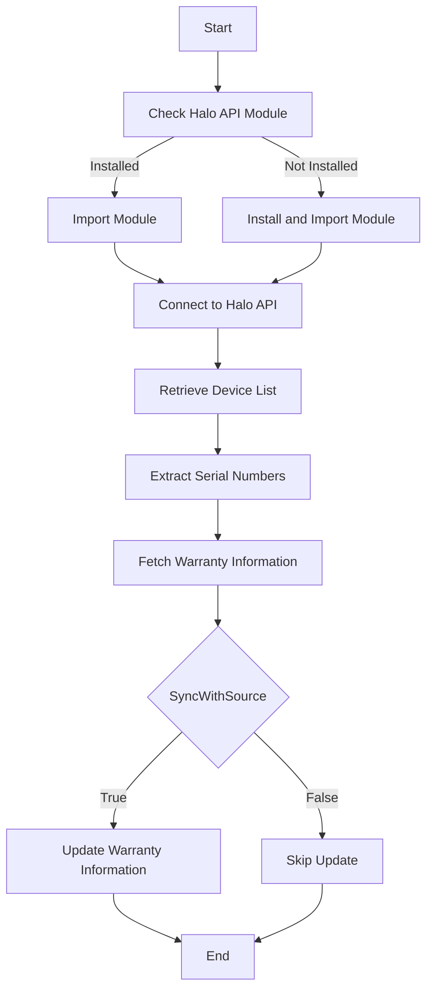

Halo Warranty refers to the process of retrieving and updating warranty information for devices managed within the Halo PSA/ITSM/Service Desk platform.

The function <SwmToken path="/private/Get-WarrantyHalo.ps1" pos="1:2:4" line-data="function  Get-WarrantyHalo {" repo-id="Z2l0aHViJTNBJTNBUG93ZXJTaGVsbFdhcnJhbnR5UmVwb3J0cyUzQSUzQVN3aW1tLURlbW8=" repo-name="PowerShellWarrantyReports">`Get-WarrantyHalo`</SwmToken> is responsible for connecting to the Halo API, retrieving device information, and updating the warranty details based on the serial number of each device.

The function first checks if the Halo API module is installed and imports it. If not, it installs and then imports the module.

It then connects to the Halo API using the provided URL, client ID, and client secret, and retrieves the list of devices.

For each device, it extracts the serial number and uses the <SwmToken path="/private/Get-WarrantyHalo.ps1" pos="55:6:8" line-data="        $WarState = Get-Warrantyinfo -DeviceSerial $Serial -client $device.client_name" repo-id="Z2l0aHViJTNBJTNBUG93ZXJTaGVsbFdhcnJhbnR5UmVwb3J0cyUzQSUzQVN3aW1tLURlbW8=" repo-name="PowerShellWarrantyReports">`Get-Warrantyinfo`</SwmToken> function to fetch the warranty information.

If the <SwmToken path="/private/Get-WarrantyHalo.ps1" pos="58:5:5" line-data="        if ($SyncWithSource -eq $true) {" repo-id="Z2l0aHViJTNBJTNBUG93ZXJTaGVsbFdhcnJhbnR5UmVwb3J0cyUzQSUzQVN3aW1tLURlbW8=" repo-name="PowerShellWarrantyReports">`SyncWithSource`</SwmToken> parameter is set to true, it updates the warranty information in the Halo system based on the retrieved data.

<SwmSnippet path="/private/Get-WarrantyHalo.ps1" line="16" repo-id="Z2l0aHViJTNBJTNBUG93ZXJTaGVsbFdhcnJhbnR5UmVwb3J0cyUzQSUzQVN3aW1tLURlbW8=">

---

## Connecting to Halo API

The function checks if the Halo API module is installed and imports it. If not, it installs and then imports the module. It then connects to the Halo API using the provided URL, client ID, and client secret.

```powershell
    if (Get-Module -ListAvailable -Name HaloAPI) {
        Import-Module HaloAPI 
    } else {
        Install-Module HaloAPI -Force
        Import-Module HaloAPI
    }

    Connect-HaloAPI -URL $HaloURL -ClientId $HaloClientID -ClientSecret $HaloClientSecret -Scopes "edit:assets"
```

---

</SwmSnippet>

<SwmSnippet path="/private/Get-WarrantyHalo.ps1" line="25" repo-id="Z2l0aHViJTNBJTNBUG93ZXJTaGVsbFdhcnJhbnR5UmVwb3J0cyUzQSUzQVN3aW1tLURlbW8=">

---

## Retrieving Device Information

The function retrieves the list of devices from the Halo system. If a previous run's results are found, it resumes from the last object; otherwise, it fetches all devices.

```powershell
    #Get Devices
    $ResumeLast = test-path 'Devices.json'
    If ($ResumeLast) {
        write-host "Found previous run results. Starting from last object." -foregroundColor green
        $Devices = get-content 'Devices.json' | convertfrom-json
    } else {
        $Devices = Get-HaloAsset -FullObjects
    }
```

---

</SwmSnippet>

<SwmSnippet path="/private/Get-WarrantyHalo.ps1" line="38" repo-id="Z2l0aHViJTNBJTNBUG93ZXJTaGVsbFdhcnJhbnR5UmVwb3J0cyUzQSUzQVN3aW1tLURlbW8=">

---

## Extracting Serial Numbers

For each device, the function extracts the serial number using the specified field. If the serial number is not found in the primary field, it searches in other custom fields.

```powershell
        # Find the Serial Number
        if ($Device."$($HaloSerialField)") {
            $Serial = $Device."$($HaloSerialField)"
        } else {
            $Serial = ($Device.Fields | where-object { $_.name -eq $HaloSerialField }).value
            if (($Serial | measure-object).count -ne 1) {
                $Serial = ($Device.customfields | where-object { $_.name -eq $HaloSerialField }).value
                if (($Serial | measure-object).count -ne 1) {
                    Write-Error "Serial field not found"
                    continue
                }
            }
        }
```

---

</SwmSnippet>

<SwmSnippet path="/private/Get-WarrantyHalo.ps1" line="54" repo-id="Z2l0aHViJTNBJTNBUG93ZXJTaGVsbFdhcnJhbnR5UmVwb3J0cyUzQSUzQVN3aW1tLURlbW8=">

---

## Fetching Warranty Information

The function uses <SwmToken path="/private/Get-WarrantyHalo.ps1" pos="55:6:8" line-data="        $WarState = Get-Warrantyinfo -DeviceSerial $Serial -client $device.client_name" repo-id="Z2l0aHViJTNBJTNBUG93ZXJTaGVsbFdhcnJhbnR5UmVwb3J0cyUzQSUzQVN3aW1tLURlbW8=" repo-name="PowerShellWarrantyReports">`Get-Warrantyinfo`</SwmToken> to fetch the warranty information for each device based on its serial number and client name.

```powershell
        Write-Progress -Activity "Grabbing Warranty information" -status "Processing $Serial. Device $i of $($devices.Count)" -percentComplete ($i / $Devices.Count * 100)      
        $WarState = Get-Warrantyinfo -DeviceSerial $Serial -client $device.client_name

```

---

</SwmSnippet>

<SwmSnippet path="/private/Get-WarrantyHalo.ps1" line="58" repo-id="Z2l0aHViJTNBJTNBUG93ZXJTaGVsbFdhcnJhbnR5UmVwb3J0cyUzQSUzQVN3aW1tLURlbW8=">

---

## Updating Warranty Information

If the <SwmToken path="/private/Get-WarrantyHalo.ps1" pos="58:5:5" line-data="        if ($SyncWithSource -eq $true) {" repo-id="Z2l0aHViJTNBJTNBUG93ZXJTaGVsbFdhcnJhbnR5UmVwb3J0cyUzQSUzQVN3aW1tLURlbW8=" repo-name="PowerShellWarrantyReports">`SyncWithSource`</SwmToken> parameter is set to true, the function updates the warranty information in the Halo system based on the retrieved data. It uses the <SwmToken path="/private/Get-WarrantyHalo.ps1" pos="69:6:8" line-data="                        $null = Set-HaloAsset -Asset $AssetUpdate" repo-id="Z2l0aHViJTNBJTNBUG93ZXJTaGVsbFdhcnJhbnR5UmVwb3J0cyUzQSUzQVN3aW1tLURlbW8=" repo-name="PowerShellWarrantyReports">`Set-HaloAsset`</SwmToken> function to update the asset with the new warranty start and end dates.

```powershell
        if ($SyncWithSource -eq $true) {

            $AssetUpdate = @{
                id = $Device.id
                warranty_start = $WarState.StartDate
                warranty_end = $WarState.EndDate
            }
            
            switch ($OverwriteWarranty) {
                $true {
                    if ($null -ne $warstate.EndDate) {
                        $null = Set-HaloAsset -Asset $AssetUpdate
                    }
                     
                }
                $false { 
                    if ($null -eq $Device.warranty_end -and $null -ne $warstate.EndDate) { 
                        $null = Set-HaloAsset -Asset $AssetUpdate
                    } 
                }
            }
```

---

</SwmSnippet>



&nbsp;

*This is an auto-generated document by Swimm AI 🌊 and has not yet been verified by a human*

<SwmMeta version="3.0.0" doc-type="overview"><sup>Powered by [Swimm](https://app.swimm.io/)</sup></SwmMeta>
