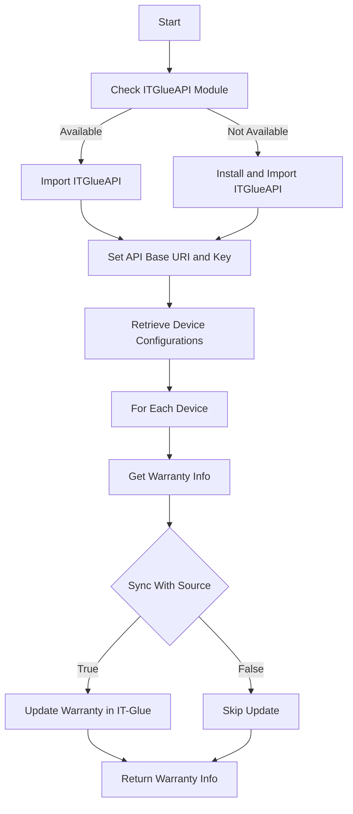
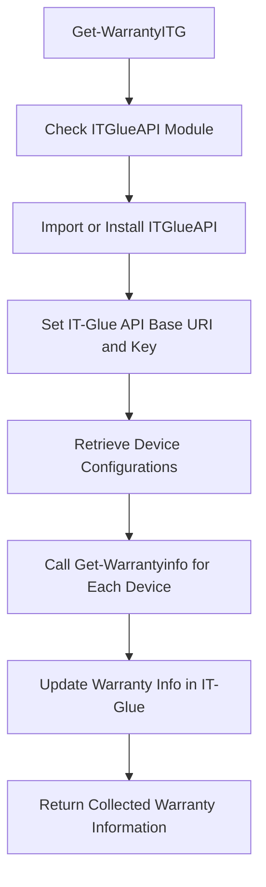

ITG Warranty refers to the process of retrieving and updating warranty information for devices managed within the <SwmToken path="/private/Get-WarrantyITG.ps1" pos="10:10:12" line-data="    write-host &quot;Source is IT-Glue. Grabbing all devices.&quot; -ForegroundColor Green" repo-id="Z2l0aHViJTNBJTNBUG93ZXJTaGVsbFdhcnJhbnR5UmVwb3J0cyUzQSUzQVN3aW1tLURlbW8=" repo-name="PowerShellWarrantyReports">`IT-Glue`</SwmToken> platform.

The function <SwmToken path="/private/Get-WarrantyITG.ps1" pos="1:2:4" line-data="function  Get-WarrantyITG {" repo-id="Z2l0aHViJTNBJTNBUG93ZXJTaGVsbFdhcnJhbnR5UmVwb3J0cyUzQSUzQVN3aW1tLURlbW8=" repo-name="PowerShellWarrantyReports">`Get-WarrantyITG`</SwmToken> is responsible for fetching all device configurations from <SwmToken path="/private/Get-WarrantyITG.ps1" pos="10:10:12" line-data="    write-host &quot;Source is IT-Glue. Grabbing all devices.&quot; -ForegroundColor Green" repo-id="Z2l0aHViJTNBJTNBUG93ZXJTaGVsbFdhcnJhbnR5UmVwb3J0cyUzQSUzQVN3aW1tLURlbW8=" repo-name="PowerShellWarrantyReports">`IT-Glue`</SwmToken> and then obtaining their warranty information.

The function first checks if the <SwmToken path="/private/Get-WarrantyITG.ps1" pos="12:5:5" line-data="        Import-module ITGlueAPI " repo-id="Z2l0aHViJTNBJTNBUG93ZXJTaGVsbFdhcnJhbnR5UmVwb3J0cyUzQSUzQVN3aW1tLURlbW8=" repo-name="PowerShellWarrantyReports">`ITGlueAPI`</SwmToken> module is available and imports it; if not, it installs and then imports the module.

It sets up the <SwmToken path="/private/Get-WarrantyITG.ps1" pos="10:10:12" line-data="    write-host &quot;Source is IT-Glue. Grabbing all devices.&quot; -ForegroundColor Green" repo-id="Z2l0aHViJTNBJTNBUG93ZXJTaGVsbFdhcnJhbnR5UmVwb3J0cyUzQSUzQVN3aW1tLURlbW8=" repo-name="PowerShellWarrantyReports">`IT-Glue`</SwmToken> API base URI and API key to authenticate and interact with the <SwmToken path="/private/Get-WarrantyITG.ps1" pos="10:10:12" line-data="    write-host &quot;Source is IT-Glue. Grabbing all devices.&quot; -ForegroundColor Green" repo-id="Z2l0aHViJTNBJTNBUG93ZXJTaGVsbFdhcnJhbnR5UmVwb3J0cyUzQSUzQVN3aW1tLURlbW8=" repo-name="PowerShellWarrantyReports">`IT-Glue`</SwmToken> service.

The function retrieves the list of device configurations from <SwmToken path="/private/Get-WarrantyITG.ps1" pos="10:10:12" line-data="    write-host &quot;Source is IT-Glue. Grabbing all devices.&quot; -ForegroundColor Green" repo-id="Z2l0aHViJTNBJTNBUG93ZXJTaGVsbFdhcnJhbnR5UmVwb3J0cyUzQSUzQVN3aW1tLURlbW8=" repo-name="PowerShellWarrantyReports">`IT-Glue`</SwmToken>, either from a saved JSON file or by querying the <SwmToken path="/private/Get-WarrantyITG.ps1" pos="10:10:12" line-data="    write-host &quot;Source is IT-Glue. Grabbing all devices.&quot; -ForegroundColor Green" repo-id="Z2l0aHViJTNBJTNBUG93ZXJTaGVsbFdhcnJhbnR5UmVwb3J0cyUzQSUzQVN3aW1tLURlbW8=" repo-name="PowerShellWarrantyReports">`IT-Glue`</SwmToken> API.

For each device, it calls the <SwmToken path="/public/Get-WarrantyInfo.ps1" pos="1:2:4" line-data="function  Get-Warrantyinfo {" repo-id="Z2l0aHViJTNBJTNBUG93ZXJTaGVsbFdhcnJhbnR5UmVwb3J0cyUzQSUzQVN3aW1tLURlbW8=" repo-name="PowerShellWarrantyReports">`Get-Warrantyinfo`</SwmToken> function to fetch the warranty details based on the device's serial number and organization name.

If the <SwmToken path="/private/Get-WarrantyITG.ps1" pos="6:5:5" line-data="        [boolean]$SyncWithSource," repo-id="Z2l0aHViJTNBJTNBUG93ZXJTaGVsbFdhcnJhbnR5UmVwb3J0cyUzQSUzQVN3aW1tLURlbW8=" repo-name="PowerShellWarrantyReports">`SyncWithSource`</SwmToken> parameter is true, the function updates the warranty expiration date in <SwmToken path="/private/Get-WarrantyITG.ps1" pos="10:10:12" line-data="    write-host &quot;Source is IT-Glue. Grabbing all devices.&quot; -ForegroundColor Green" repo-id="Z2l0aHViJTNBJTNBUG93ZXJTaGVsbFdhcnJhbnR5UmVwb3J0cyUzQSUzQVN3aW1tLURlbW8=" repo-name="PowerShellWarrantyReports">`IT-Glue`</SwmToken> with the retrieved warranty information.

The function handles both overwriting existing warranty information and updating only missing warranty details based on the <SwmToken path="/private/Get-WarrantyITG.ps1" pos="8:5:5" line-data="        [boolean]$OverwriteWarranty" repo-id="Z2l0aHViJTNBJTNBUG93ZXJTaGVsbFdhcnJhbnR5UmVwb3J0cyUzQSUzQVN3aW1tLURlbW8=" repo-name="PowerShellWarrantyReports">`OverwriteWarranty`</SwmToken> parameter.

Finally, the function returns the collected warranty information for all devices.



<SwmSnippet path="/private/Get-WarrantyITG.ps1" line="1" repo-id="Z2l0aHViJTNBJTNBUG93ZXJTaGVsbFdhcnJhbnR5UmVwb3J0cyUzQSUzQVN3aW1tLURlbW8=">

---

# ITG Warranty Function

The <SwmToken path="/private/Get-WarrantyITG.ps1" pos="1:2:4" line-data="function  Get-WarrantyITG {" repo-id="Z2l0aHViJTNBJTNBUG93ZXJTaGVsbFdhcnJhbnR5UmVwb3J0cyUzQSUzQVN3aW1tLURlbW8=" repo-name="PowerShellWarrantyReports">`Get-WarrantyITG`</SwmToken> function is responsible for fetching all device configurations from IT-Glue and then obtaining their warranty information. It sets up the IT-Glue API base URI and API key to authenticate and interact with the IT-Glue service. The function retrieves the list of device configurations from IT-Glue, either from a saved JSON file or by querying the IT-Glue API. For each device, it calls the <SwmToken path="/public/Get-WarrantyInfo.ps1" pos="1:2:4" line-data="function  Get-Warrantyinfo {" repo-id="Z2l0aHViJTNBJTNBUG93ZXJTaGVsbFdhcnJhbnR5UmVwb3J0cyUzQSUzQVN3aW1tLURlbW8=" repo-name="PowerShellWarrantyReports">`Get-Warrantyinfo`</SwmToken> function to fetch the warranty details based on the device's serial number and organization name. If the <SwmToken path="/private/Get-WarrantyITG.ps1" pos="6:5:5" line-data="        [boolean]$SyncWithSource," repo-id="Z2l0aHViJTNBJTNBUG93ZXJTaGVsbFdhcnJhbnR5UmVwb3J0cyUzQSUzQVN3aW1tLURlbW8=" repo-name="PowerShellWarrantyReports">`SyncWithSource`</SwmToken> parameter is true, the function updates the warranty expiration date in IT-Glue with the retrieved warranty information. The function handles both overwriting existing warranty information and updating only missing warranty details based on the <SwmToken path="/private/Get-WarrantyITG.ps1" pos="8:5:5" line-data="        [boolean]$OverwriteWarranty" repo-id="Z2l0aHViJTNBJTNBUG93ZXJTaGVsbFdhcnJhbnR5UmVwb3J0cyUzQSUzQVN3aW1tLURlbW8=" repo-name="PowerShellWarrantyReports">`OverwriteWarranty`</SwmToken> parameter. Finally, the function returns the collected warranty information for all devices.

```powershell
function  Get-WarrantyITG {
    [CmdletBinding()]
    Param(
        [string]$ITGAPIKey,
        [String]$ITGAPIURL,
        [boolean]$SyncWithSource,
        [boolean]$Missingonly,
        [boolean]$OverwriteWarranty
    )
    write-host "Source is IT-Glue. Grabbing all devices." -ForegroundColor Green
    If (Get-Module -ListAvailable -Name "ITGlueAPI") { 
        Import-module ITGlueAPI 
    }
    Else { 
        Install-Module ITGlueAPI -Force
        Import-Module ITGlueAPI
    }
    #Settings IT-Glue logon information
    Add-ITGlueBaseURI -base_uri $ITGAPIURL
    Add-ITGlueAPIKey  $ITGAPIKey
    write-host "Getting IT-Glue configuration list" -foregroundColor green
```

---

</SwmSnippet>

<SwmSnippet path="/public/Get-WarrantyInfo.ps1" line="1" repo-id="Z2l0aHViJTNBJTNBUG93ZXJTaGVsbFdhcnJhbnR5UmVwb3J0cyUzQSUzQVN3aW1tLURlbW8=">

---

# Fetching Warranty Information

The `Get-Warrantyinfo` function is called within `Get-WarrantyITG` to fetch the warranty details for each device. It determines the appropriate vendor-specific warranty retrieval function to call based on the device's serial number and organization name.

```powershell
function  Get-Warrantyinfo {
    [CmdletBinding()]
    Param(
        [string]$DeviceSerial,
        [String]$client,
        [String]$vendor
    )
    if ($LogActions) { add-content -path $LogFile -Value "Starting lookup for $($DeviceSerial),$($Client)" -force }
    if ($vendor) {
        switch ($vendor) {
            HP { get-HPWarranty -SourceDevice $DeviceSerial -Client $line.client }
            Dell { get-DellWarranty -SourceDevice $DeviceSerial -Client $line.client }
            Lenovo { get-LenovoWarranty -SourceDevice $DeviceSerial -Client $line.client }
            MS { Get-MSWarranty -SourceDevice $DeviceSerial -Client $line.client }
            Apple { get-AppleWarranty -SourceDevice $DeviceSerial -client $line.client }
            Toshiba { get-ToshibaWarranty -SourceDevice $DeviceSerial -client $line.client }
        }
    }
    else {
        switch ($DeviceSerial.Length) {
            7 { get-DellWarranty -SourceDevice $DeviceSerial -client $Client }
```

---

</SwmSnippet>



*This is an auto-generated document by Swimm AI 🌊 and has not yet been verified by a human*

<SwmMeta version="3.0.0" doc-type="overview"><sup>Powered by [Swimm](https://app.swimm.io/)</sup></SwmMeta>
