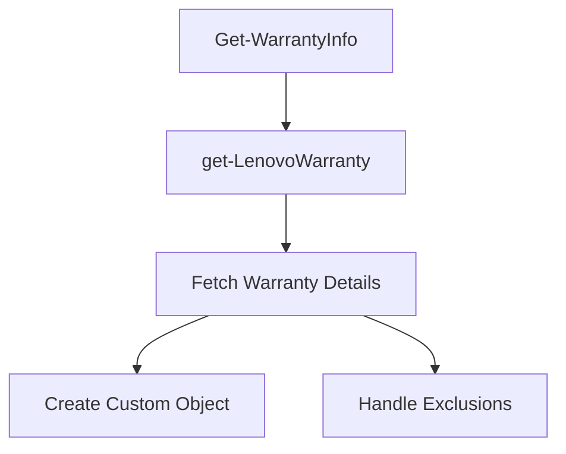

Lenovo Warranty refers to the process of retrieving and reporting warranty information for Lenovo devices.

The function <SwmToken path="/private/Get-LenovoWarranty.ps1" pos="1:2:4" line-data="function get-LenovoWarranty([Parameter(Mandatory = $true)]$SourceDevice, $client) {" repo-id="Z2l0aHViJTNBJTNBUG93ZXJTaGVsbFdhcnJhbnR5UmVwb3J0cyUzQSUzQVN3aW1tLURlbW8=" repo-name="PowerShellWarrantyReports">`get-LenovoWarranty`</SwmToken> is responsible for fetching warranty details from an external API using the device's serial number.

If the warranty information is successfully retrieved, it creates a custom object containing details such as the serial number, warranty product name, start date, end date, and warranty status.

If the warranty information cannot be retrieved, it returns a custom object indicating that the warranty information could not be obtained.

The function also handles cases where Lenovo lookups are excluded, returning a custom object that indicates the exclusion.

The <SwmToken path="/public/Get-WarrantyInfo.ps1" pos="13:5:7" line-data="            Lenovo { get-LenovoWarranty -SourceDevice $DeviceSerial -Client $line.client }" repo-id="Z2l0aHViJTNBJTNBUG93ZXJTaGVsbFdhcnJhbnR5UmVwb3J0cyUzQSUzQVN3aW1tLURlbW8=" repo-name="PowerShellWarrantyReports">`get-LenovoWarranty`</SwmToken> function is utilized within the <SwmToken path="/public/Get-WarrantyInfo.ps1" pos="1:2:4" line-data="function  Get-Warrantyinfo {" repo-id="Z2l0aHViJTNBJTNBUG93ZXJTaGVsbFdhcnJhbnR5UmVwb3J0cyUzQSUzQVN3aW1tLURlbW8=" repo-name="PowerShellWarrantyReports">`Get-Warrantyinfo`</SwmToken> script to integrate Lenovo warranty information into the overall warranty reporting process.

<SwmSnippet path="/private/Get-LenovoWarranty.ps1" line="1" repo-id="Z2l0aHViJTNBJTNBUG93ZXJTaGVsbFdhcnJhbnR5UmVwb3J0cyUzQSUzQVN3aW1tLURlbW8=">

---

## Fetching Warranty Details

The function <SwmToken path="/public/Get-WarrantyInfo.ps1" pos="13:5:7" line-data="            Lenovo { get-LenovoWarranty -SourceDevice $DeviceSerial -Client $line.client }" repo-id="Z2l0aHViJTNBJTNBUG93ZXJTaGVsbFdhcnJhbnR5UmVwb3J0cyUzQSUzQVN3aW1tLURlbW8=" repo-name="PowerShellWarrantyReports">`get-LenovoWarranty`</SwmToken> is responsible for fetching warranty details from an external API using the device's serial number. It creates a custom object containing the warranty details or indicates if the information could not be retrieved.

```powershell
function get-LenovoWarranty([Parameter(Mandatory = $true)]$SourceDevice, $client) {
    if ($script:ExcludeLenovo -ne $True) {
        $today = Get-Date -Format yyyy-MM-dd
        $APIURL = "https://warrantyapiproxy.azurewebsites.net/api/Lenovo?Serial=$SourceDevice"
        $Req = Invoke-RestMethod -Uri $APIURL -Method get
        if ($req.Warproduct) {
            $warlatest = $Req.EndDate | ForEach-Object { [datetime]$_ } | sort-object | select-object -last 1 
            $WarrantyState = if ($warlatest -le $today) { "Expired" } else { "OK" }
            $WarObj = [PSCustomObject]@{
                'Serial'                = $Req.Serial
                'Warranty Product name' = $Req.WarProduct
                'StartDate'             = [DateTime]($Req.StartDate)
                'EndDate'               = [DateTime]($Req.EndDate)
                'Warranty Status'       = $WarrantyState
                'Client'                = $Client
            }
        } else {
            $WarObj = [PSCustomObject]@{
                'Serial'                = $SourceDevice
                'Warranty Product name' = 'Could not get warranty information'
                'StartDate'             = $null
```

---

</SwmSnippet>

<SwmSnippet path="/public/Get-WarrantyInfo.ps1" line="12" repo-id="Z2l0aHViJTNBJTNBUG93ZXJTaGVsbFdhcnJhbnR5UmVwb3J0cyUzQSUzQVN3aW1tLURlbW8=">

---

## Integration with Warranty Reporting

The <SwmToken path="/public/Get-WarrantyInfo.ps1" pos="13:5:7" line-data="            Lenovo { get-LenovoWarranty -SourceDevice $DeviceSerial -Client $line.client }" repo-id="Z2l0aHViJTNBJTNBUG93ZXJTaGVsbFdhcnJhbnR5UmVwb3J0cyUzQSUzQVN3aW1tLURlbW8=" repo-name="PowerShellWarrantyReports">`get-LenovoWarranty`</SwmToken> function is utilized within the <SwmToken path="/public/Get-WarrantyInfo.ps1" pos="1:2:4" line-data="function  Get-Warrantyinfo {" repo-id="Z2l0aHViJTNBJTNBUG93ZXJTaGVsbFdhcnJhbnR5UmVwb3J0cyUzQSUzQVN3aW1tLURlbW8=" repo-name="PowerShellWarrantyReports">`Get-Warrantyinfo`</SwmToken> script to integrate Lenovo warranty information into the overall warranty reporting process.

```powershell
            Dell { get-DellWarranty -SourceDevice $DeviceSerial -Client $line.client }
            Lenovo { get-LenovoWarranty -SourceDevice $DeviceSerial -Client $line.client }
            MS { Get-MSWarranty -SourceDevice $DeviceSerial -Client $line.client }
            Apple { get-AppleWarranty -SourceDevice $DeviceSerial -client $line.client }
            Toshiba { get-ToshibaWarranty -SourceDevice $DeviceSerial -client $line.client }
        }
    }
    else {
        switch ($DeviceSerial.Length) {
            7 { get-DellWarranty -SourceDevice $DeviceSerial -client $Client }
            8 { get-LenovoWarranty -SourceDevice $DeviceSerial -client $Client }
            9 { get-ToshibaWarranty -SourceDevice $DeviceSerial -client $line.client }
```

---

</SwmSnippet>

<SwmSnippet path="/public/Get-WarrantyInfo.ps1" line="12" repo-id="Z2l0aHViJTNBJTNBUG93ZXJTaGVsbFdhcnJhbnR5UmVwb3J0cyUzQSUzQVN3aW1tLURlbW8=">

---

## Usage in <SwmToken path="/public/Get-WarrantyInfo.ps1" pos="1:2:4" line-data="function  Get-Warrantyinfo {" repo-id="Z2l0aHViJTNBJTNBUG93ZXJTaGVsbFdhcnJhbnR5UmVwb3J0cyUzQSUzQVN3aW1tLURlbW8=" repo-name="PowerShellWarrantyReports">`Get-Warrantyinfo`</SwmToken>

The <SwmToken path="/public/Get-WarrantyInfo.ps1" pos="13:5:7" line-data="            Lenovo { get-LenovoWarranty -SourceDevice $DeviceSerial -Client $line.client }" repo-id="Z2l0aHViJTNBJTNBUG93ZXJTaGVsbFdhcnJhbnR5UmVwb3J0cyUzQSUzQVN3aW1tLURlbW8=" repo-name="PowerShellWarrantyReports">`get-LenovoWarranty`</SwmToken>ized within the `Get-WarrantyInfo` script to integrate Lenovo warranty information into the overall warranty reporting process.

```powershell
            Dell { get-DellWarranty -SourceDevice $DeviceSerial -Client $line.client }
            Lenovo { get-LenovoWarranty -SourceDevice $DeviceSerial -Client $line.client }
            MS { Get-MSWarranty -SourceDevice $DeviceSerial -Client $line.client }
            Apple { get-AppleWarranty -SourceDevice $DeviceSerial -client $line.client }
            Toshiba { get-ToshibaWarranty -SourceDevice $DeviceSerial -client $line.client }
        }
    }
    else {
        switch ($DeviceSerial.Length) {
            7 { get-DellWarranty -SourceDevice $DeviceSerial -client $Client }
            8 { get-LenovoWarranty -SourceDevice $DeviceSerial -client $Client }
            9 { get-ToshibaWarranty -SourceDevice $DeviceSerial -client $line.client }
```

---

</SwmSnippet>



&nbsp;

*This is an auto-generated document by Swimm AI 🌊 and has not yet been verified by a human*

<SwmMeta version="3.0.0" doc-type="overview"><sup>Powered by [Swimm](https://app.swimm.io/)</sup></SwmMeta>
