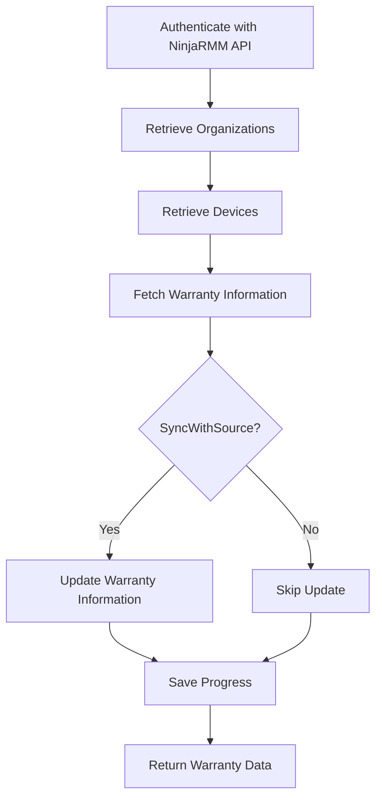

Ninja Warranty refers to the process of retrieving and updating warranty information for devices managed by NinjaRMM, an IT management platform.

The function <SwmToken path="/private/Get-WarrantyNinja.ps1" pos="1:2:4" line-data="function  Get-WarrantyNinja {" repo-id="Z2l0aHViJTNBJTNBUG93ZXJTaGVsbFdhcnJhbnR5UmVwb3J0cyUzQSUzQVN3aW1tLURlbW8=" repo-name="PowerShellWarrantyReports">`Get-WarrantyNinja`</SwmToken> is responsible for authenticating with the NinjaRMM API using client credentials and retrieving a list of organizations and devices.

It then iterates through the devices, fetching warranty information for each device using the <SwmToken path="/public/Get-WarrantyInfo.ps1" pos="1:2:4" line-data="function  Get-Warrantyinfo {" repo-id="Z2l0aHViJTNBJTNBUG93ZXJTaGVsbFdhcnJhbnR5UmVwb3J0cyUzQSUzQVN3aW1tLURlbW8=" repo-name="PowerShellWarrantyReports">`Get-Warrantyinfo`</SwmToken> function.

If the <SwmToken path="/private/Get-WarrantyNinja.ps1" pos="7:5:5" line-data="        [boolean]$SyncWithSource," repo-id="Z2l0aHViJTNBJTNBUG93ZXJTaGVsbFdhcnJhbnR5UmVwb3J0cyUzQSUzQVN3aW1tLURlbW8=" repo-name="PowerShellWarrantyReports">`SyncWithSource`</SwmToken> parameter is set to true, the function updates the warranty information in NinjaRMM, either overwriting existing data or adding new data if none exists.

The function handles pagination to ensure all devices are processed and maintains progress by saving intermediate results to a file.



## Setting Up Ninja Warranty

To update NinjaOne first you will need to create a Global Custom Field to hold your expiry date. Call this something like 'Warranty Expiry', use a Date type and make a note of the field name once saved. In my case it is warrantyExpiry. Next you need to generate Ninja API Credentials. Create a new 'API Services' key with 'Management' and 'Monitoring' Access and Client Credentials as an allowed grant type. If needed enter 'Localhost' in the redirect URL. For the <SwmToken path="/private/Get-WarrantyNinja.ps1" pos="4:5:5" line-data="        [string]$NinjaURL," repo-id="Z2l0aHViJTNBJTNBUG93ZXJTaGVsbFdhcnJhbnR5UmVwb3J0cyUzQSUzQVN3aW1tLURlbW8=" repo-name="PowerShellWarrantyReports">`NinjaURL`</SwmToken> enter the Ninja URL for your instance. For example <https://app.ninjarmm.com>, <https://eu.ninjarmm.com>, etc.

## Using the `update-warrantyinfo` Command

Use the following command to update the warranty information: `update-warrantyinfo -Ninja -NinjaClientID 'YourAPIClientID' -NinjaSecret 'YourAPISecret' -NinjaURL 'https://eu.ninjarmm.com' -NinjaFieldName 'warrantyExpiry' -SyncWithSource -OverwriteWarranty -ExcludeApple`.

<SwmSnippet path="/private/Get-WarrantyNinja.ps1" line="1" repo-id="Z2l0aHViJTNBJTNBUG93ZXJTaGVsbFdhcnJhbnR5UmVwb3J0cyUzQSUzQVN3aW1tLURlbW8=">

---

## Function <SwmToken path="/private/Get-WarrantyNinja.ps1" pos="1:2:4" line-data="function  Get-WarrantyNinja {" repo-id="Z2l0aHViJTNBJTNBUG93ZXJTaGVsbFdhcnJhbnR5UmVwb3J0cyUzQSUzQVN3aW1tLURlbW8=" repo-name="PowerShellWarrantyReports">`Get-WarrantyNinja`</SwmToken>

The function `Get-WarrantyNinja` is responsible for authenticating with the NinjaRMM API using client credentials and retrieving a list of organizations and devices. It then iterates through the devices, fetching warranty information for each device using the `Get-Warrantyinfo` function. If the `SyncWithSource` parameter is set to true, the function updates the warranty information in NinjaRMM, either overwriting existing data or adding new data if none exists. The function handles pagination to ensure all devices are processed and maintains progress by saving intermediate results to a file.

```powershell
function  Get-WarrantyNinja {
    [CmdletBinding()]
    Param(
        [string]$NinjaURL,
        [String]$Secretkey,
        [String]$AccessKey,
        [boolean]$SyncWithSource,
        [boolean]$OverwriteWarranty,
        [string]$NinjaFieldName
    )
    $AuthBody = @{
        'grant_type'    = 'client_credentials'
        'client_id'     = $AccessKey
        'client_secret' = $Secretkey
        'scope'         = 'management monitoring' 
    }
    
    $Result = Invoke-WebRequest -uri "$($NinjaURL)/ws/oauth/token" -Method POST -Body $AuthBody -ContentType 'application/x-www-form-urlencoded'
    
    $AuthHeader = @{
        'Authorization' = "Bearer $(($Result.content | convertfrom-json).access_token)"
```

---

</SwmSnippet>

# Main functions

There are several main functions in this folder. Some of them are <SwmToken path="/private/Get-WarrantyNinja.ps1" pos="1:2:4" line-data="function  Get-WarrantyNinja {" repo-id="Z2l0aHViJTNBJTNBUG93ZXJTaGVsbFdhcnJhbnR5UmVwb3J0cyUzQSUzQVN3aW1tLURlbW8=" repo-name="PowerShellWarrantyReports">`Get-WarrantyNinja`</SwmToken> and <SwmToken path="/public/Get-WarrantyInfo.ps1" pos="1:2:4" line-data="function  Get-Warrantyinfo {" repo-id="Z2l0aHViJTNBJTNBUG93ZXJTaGVsbFdhcnJhbnR5UmVwb3J0cyUzQSUzQVN3aW1tLURlbW8=" repo-name="PowerShellWarrantyReports">`Get-Warrantyinfo`</SwmToken>. We will dive a little into both.

<SwmSnippet path="/private/Get-WarrantyNinja.ps1" line="1" repo-id="Z2l0aHViJTNBJTNBUG93ZXJTaGVsbFdhcnJhbnR5UmVwb3J0cyUzQSUzQVN3aW1tLURlbW8=">

---

## <SwmToken path="/private/Get-WarrantyNinja.ps1" pos="1:2:4" line-data="function  Get-WarrantyNinja {" repo-id="Z2l0aHViJTNBJTNBUG93ZXJTaGVsbFdhcnJhbnR5UmVwb3J0cyUzQSUzQVN3aW1tLURlbW8=" repo-name="PowerShellWarrantyReports">`Get-WarrantyNinja`</SwmToken>

The function <SwmToken path="/private/Get-WarrantyNinja.ps1" pos="1:2:4" line-data="function  Get-WarrantyNinja {" repo-id="Z2l0aHViJTNBJTNBUG93ZXJTaGVsbFdhcnJhbnR5UmVwb3J0cyUzQSUzQVN3aW1tLURlbW8=" repo-name="PowerShellWarrantyReports">`Get-WarrantyNinja`</SwmToken> is responsible for authenticating with the NinjaRMM API using client credentials and retrieving a list of organizations and devices. It then iterates through the devices, fetching warranty information for each device using the <SwmToken path="/public/Get-WarrantyInfo.ps1" pos="1:2:4" line-data="function  Get-Warrantyinfo {" repo-id="Z2l0aHViJTNBJTNBUG93ZXJTaGVsbFdhcnJhbnR5UmVwb3J0cyUzQSUzQVN3aW1tLURlbW8=" repo-name="PowerShellWarrantyReports">`Get-Warrantyinfo`</SwmToken> function. If the <SwmToken path="/private/Get-WarrantyNinja.ps1" pos="7:5:5" line-data="        [boolean]$SyncWithSource," repo-id="Z2l0aHViJTNBJTNBUG93ZXJTaGVsbFdhcnJhbnR5UmVwb3J0cyUzQSUzQVN3aW1tLURlbW8=" repo-name="PowerShellWarrantyReports">`SyncWithSource`</SwmToken> parameter is set to true, the function updates the warranty information in NinjaRMM, either overwriting existing data or adding new data if none exists. The function handles pagination to ensure all devices are processed and maintains progress by saving intermediate results to a file.

```powershell
function  Get-WarrantyNinja {
    [CmdletBinding()]
    Param(
        [string]$NinjaURL,
        [String]$Secretkey,
        [String]$AccessKey,
        [boolean]$SyncWithSource,
        [boolean]$OverwriteWarranty,
        [string]$NinjaFieldName
    )
    $AuthBody = @{
        'grant_type'    = 'client_credentials'
        'client_id'     = $AccessKey
        'client_secret' = $Secretkey
        'scope'         = 'management monitoring' 
    }
    
    $Result = Invoke-WebRequest -uri "$($NinjaURL)/ws/oauth/token" -Method POST -Body $AuthBody -ContentType 'application/x-www-form-urlencoded'
    
    $AuthHeader = @{
        'Authorization' = "Bearer $(($Result.content | convertfrom-json).access_token)"
```

---

</SwmSnippet>

<SwmSnippet path="/public/Get-WarrantyInfo.ps1" line="1" repo-id="Z2l0aHViJTNBJTNBUG93ZXJTaGVsbFdhcnJhbnR5UmVwb3J0cyUzQSUzQVN3aW1tLURlbW8=">

---

## <SwmToken path="/public/Get-WarrantyInfo.ps1" pos="1:2:4" line-data="function  Get-Warrantyinfo {" repo-id="Z2l0aHViJTNBJTNBUG93ZXJTaGVsbFdhcnJhbnR5UmVwb3J0cyUzQSUzQVN3aW1tLURlbW8=" repo-name="PowerShellWarrantyReports">`Get-Warrantyinfo`</SwmToken>

The function <SwmToken path="/public/Get-WarrantyInfo.ps1" pos="1:2:4" line-data="function  Get-Warrantyinfo {" repo-id="Z2l0aHViJTNBJTNBUG93ZXJTaGVsbFdhcnJhbnR5UmVwb3J0cyUzQSUzQVN3aW1tLURlbW8=" repo-name="PowerShellWarrantyReports">`Get-Warrantyinfo`</SwmToken> is called by <SwmToken path="/private/Get-WarrantyNinja.ps1" pos="1:2:4" line-data="function  Get-WarrantyNinja {" repo-id="Z2l0aHViJTNBJTNBUG93ZXJTaGVsbFdhcnJhbnR5UmVwb3J0cyUzQSUzQVN3aW1tLURlbW8=" repo-name="PowerShellWarrantyReports">`Get-WarrantyNinja`</SwmToken> to fetch warranty information for a specific device. It determines the vendor based on the device serial number or provided vendor parameter and calls the appropriate vendor-specific function to retrieve the warranty information.

```powershell
function  Get-Warrantyinfo {
    [CmdletBinding()]
    Param(
        [string]$DeviceSerial,
        [String]$client,
        [String]$vendor
    )
    if ($LogActions) { add-content -path $LogFile -Value "Starting lookup for $($DeviceSerial),$($Client)" -force }
    if ($vendor) {
        switch ($vendor) {
            HP { get-HPWarranty -SourceDevice $DeviceSerial -Client $line.client }
            Dell { get-DellWarranty -SourceDevice $DeviceSerial -Client $line.client }
            Lenovo { get-LenovoWarranty -SourceDevice $DeviceSerial -Client $line.client }
            MS { Get-MSWarranty -SourceDevice $DeviceSerial -Client $line.client }
            Apple { get-AppleWarranty -SourceDevice $DeviceSerial -client $line.client }
            Toshiba { get-ToshibaWarranty -SourceDevice $DeviceSerial -client $line.client }
        }
    }
    else {
        switch ($DeviceSerial.Length) {
            7 { get-DellWarranty -SourceDevice $DeviceSerial -client $Client }
```

---

</SwmSnippet>

&nbsp;

*This is an auto-generated document by Swimm AI 🌊 and has not yet been verified by a human*

<SwmMeta version="3.0.0" doc-type="overview"><sup>Powered by [Swimm](https://app.swimm.io/)</sup></SwmMeta>
